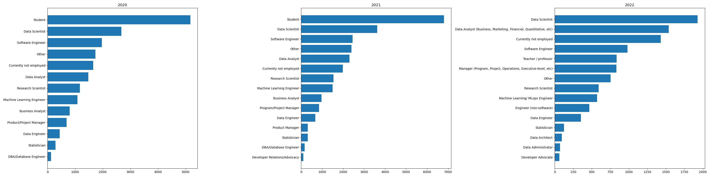
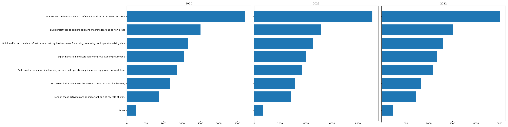
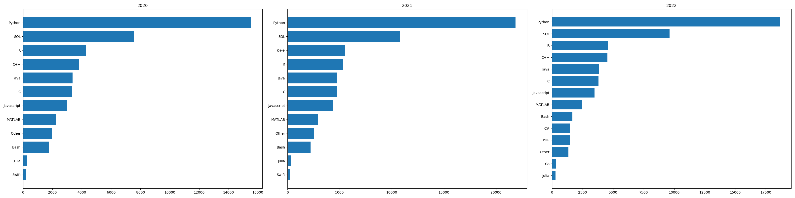
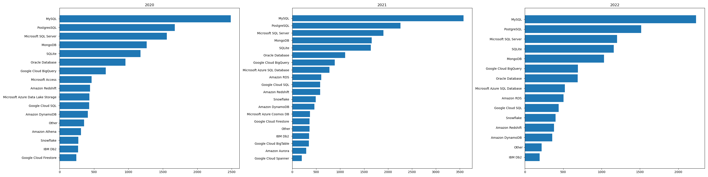
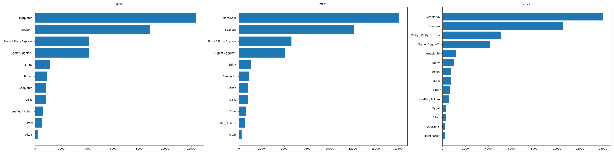
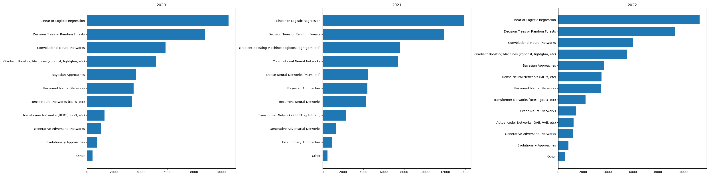

## 簡介
這個課程練習專案「資料科學家的工具箱」透過 2020、2021 與 2022 年 [kaggle.com](https://www.kaggle.com) 所舉辦的 Kaggle Machine Learning and Data Science Survey 普查問卷進行縱貫研究，針對下列三個常見初學者問題進行探索性分析。

- 從事資料科學工作的職缺抬頭（title）有哪些？
- 從事資料科學工作的日常內容是什麼？
- 想要從事資料科學工作，需要具備哪些技能與知識？

我們使用了 `pandas` 與 `sqlite3` 建立了資料庫，利用 `matplotlib` 進行概念驗證並做出成品。

## 如何重現
- 安裝 Miniconda
- 依據 `environment.yml` 建立環境：
```bash
conda env create -f environment.yml
```
- 將 `data/` 資料夾中的 `kaggle_survey_2020_responses.csv`, `kaggle_survey_2021_responses.csv`, `kaggle_survey_2022_responses.csv` 置放於工作目錄中的 `data/` 資料夾。
- 啟動環境並執行 `python create_kaggle_survey_db.py` 就能在 `data/` 資料夾中建立 `kaggle_survey.db`
- 啟動環境並執行 
```bash
python create_longitudinal_analysis_plots.py 
```
就能輸出六組水平長條圖。

### 從事資料科學工作的職缺抬頭（title）有哪些？

Data Scientist, Data Analyst, Software Engineer ...etc.


### 從事資料科學工作的日常內容是什麼？

Analyze and understand data to influence product or business decisions.



### 想要從事資料科學工作，需要具備哪些技能與知識？

Programming languages: Python, SQL, R, C++



Database: MySQL, PostgresSQL, MS SQL Server. 



Visualizations: Matplotlib, Seaborn, Plotly.



Machine Learning Algorithm: Linear/Logistic regression, Decision Tree/Random Forrest, Deep Learning, XGBoost.



## 課程重點

- Data Cleaning
- Reshaping: 複習pd.melt, 將寬格式（wide format）的數據框轉換為長格式（long format)